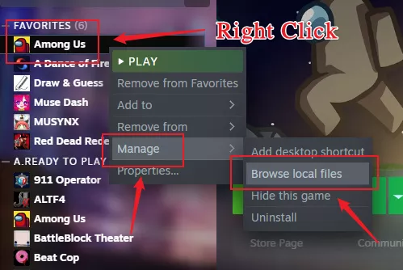

## Manual Installation

1. Click [here](https://github.com/KARPED1EM/TownOfHostEdited/releases/latest) and download the latest relaease.

2. If you use Steam, please operate according to the img botton, the folder that pops up is the root directory of the game.

   

3. If you use Epic, please manually find the root directory of the game, there are specific tutorials online.

4. After finding the root directory of the game, open the .zip file just downloaded, and drag all the files inside into the root directory of the game. ([Click to view the demo](https://npm.elemecdn.com/tohe-doc-resources@1.0.2/MoveFile.gif))

5. Now you can start the game on Steam or Epic. It takes time to download the dependent files when starting the mod for the first time, please wait patiently for the game to pop up.

## Use Mod Manager (OUT OF DATE)

1. Click [here](https://goodloss.fr/latest) and download the Mod Manager.
2. Run Mod Manager & Select `Mods` > `Other Mods` > `Town Of Host Edited` > `Download`.

****
