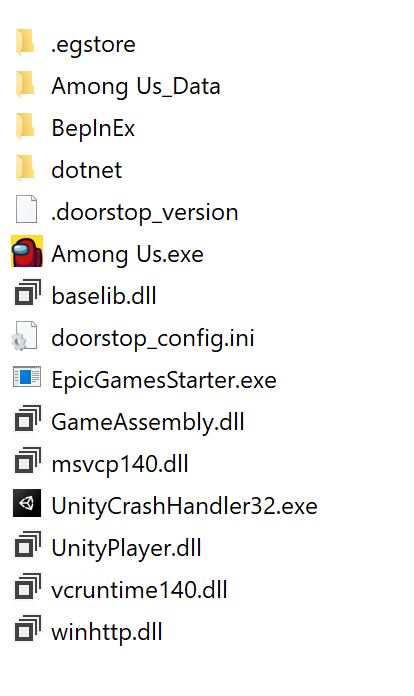
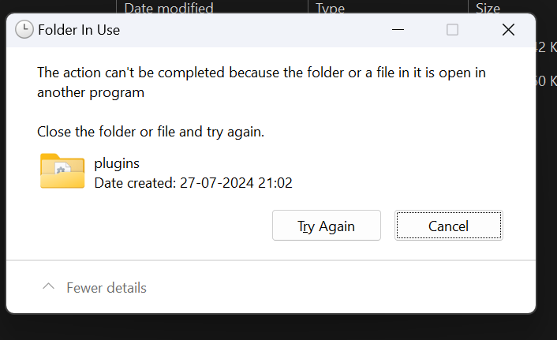

# INSTALLATION

## Distribution Policy

<b>Alpha Builds are not for distribution. If you are found to be distributing these builds, you will be removed from the respective role and your access to the builds will be revoked.  
If you are a content creator, you may use these builds in your videos, but you may not provide a download link for your viewers. If you are found to be distributing these builds, you will be removed from the respective role and your access to the builds will be revoked.  
This policy is in place to keep the integrity of our Sponsor, Contributor, & Tester roles. If you are interested in becoming one of these roles, please see the below sections for more information.</b>   

<b>How to get Stable Builds</b>

* Visit `#mod-release` in the [TOH: Enhanced Discord](https://discord.gg/tohe), or go [here](https://github.com/0xDrMoe/TownofHost-Enhanced/releases) to download it directly from GitHub. 

Installation requires that you own a PC version of Among Us on Steam, Epic, Xbox App, or Itch. Microsoft Store will not work.

 

<b>Install TOHE for Steam</b>

Notice: You can follow the installation video [HERE](https://www.youtube.com/watch?v=2oyD75caFQ0) if you want visuals with steps. However, the below steps work just fine.

1. Download the latest full Release of TOHE in `#mod-release` or [here](https://github.com/0xDrMoe/TownofHost-Enhanced/releases). You only need the main zip such as "`TOHE.v1.0.0.zip`", not the source code files. DO NOT DOWNLOAD THE `-MS` FILE, IT WILL NOT WORK!

2. Once the download is complete, unzip it into a new empty folder like on desktop.

3. Locate your AmongUs install. For example, if you own the game on Steam, you can find this by right clicking on the game in your library, selecting "Manage", and finally selecting "Browse local files." 

4. Select all of the files in your Among Us installation and copy them to the folder that now has the files from the TOHE release. The folder should now look something like this: 

5. Within the TOHE folder, run `Among Us.exe`. The first time running it may take some time while the mod sets up its files. If you see a black screen, just wait a couple minutes. Once it finishes loading, you should get a popup with TOHE news. If you do not see anything about TOHE, double check that your files are all in the same folder.

6. `(Optional)` Right click your `Among Us.exe` and click '`Create shortcut`'. Move your new shortcut to wherever you can easily access it, such as your Desktop!
#### You have now installed Town of Host: Enhanced! All that remains is to start up a private lobby and customize your settings.

> From: NotPyro404

 

<b>Install TOHE for Epic Games</b>

Notice: You can follow the installation video [HERE](https://www.youtube.com/watch?v=2oyD75caFQ0) if you want visuals with steps. However, the below steps work just fine.

1. Download the latest full Release of TOHE in `#mod-release` or [here](https://github.com/0xDrMoe/TownofHost-Enhanced/releases). You only need the main zip such as "`TOHE.v1.0.0.zip`", not the source code files. DO NOT DOWNLOAD THE `-MS` FILE, IT WILL NOT WORK!

2. Once the download is complete, unzip it into a new empty folder somewhere like on desktop.

3. Locate your AmongUs install. Find Among Us and click on the 3 dots `...` > click the folder icon button on the installation bar. 

4. Select all of the files in your TOHE folder and copy them to the Among Us installation folder. The folder should now look something like this: 

5. Within the Among Us folder, run `EpicGamesStarter.exe` ([Download Here](https://github.com/whichtwix/EpicGamesStarter/releases/tag/1.0.2) & Follow instructions on page.) The first time running it may take some time while installing a prerequisite and the mod sets up its files. If you see a black screen or a console window, just wait a couple minutes. Once it finishes loading, you should get a popup with TOHE news. If you do not see anything about TOHE, double check that your files are all in the same folder.

6. Add the folder you put the mod and among us files in as a exclusion for any antivirus you have and windows defender.

7. `(Optional)` Right click your `EpicGamesStarter.exe` and click '`Create shortcut`'. Move your new shortcut to wherever you can easily access it, such as your Desktop!

#### You have now installed Town of Host: Enhanced! All that remains is to start up a private lobby and customize your settings.

> From: Twix

 

<b>Install TOHE for Xbox App</b>

1. Download the latest full Release of TOHE [here](https://github.com/0xDrMoe/TownofHost-Enhanced/releases). You only need the other zip such as "`TOHE.v1.0.0-MS.zip`", not the source code files. MAKE SURE YOU DOWNLOAD THE `-MS` FILE, OTHERWISE IT WILL NOT WORK! 

2. Once the download is complete, unzip it into a new empty folder like on desktop.

3. Locate your AmongUs install. For example, if you own the game on Xbox App, you need to go to Xbox App, then you can find this by right clicking on the game in your Library, selecting "Manage", then "Files", and finally selecting "Browse files". 

4. Select all of the files in your TOHE folder and copy them to the Among Us installation folder. The folder should now look something like this: 

5. Now go back to Xbox App, then launch the game like you would normally do. Theres no problem in launching the game with `Among Us.exe` at all. 
NOTE: This is for the `Xbox App` version of Among Us. You cannot download TOHE on the Microsoft Store version of Among Us. TOHE cannot be downloaded on Xbox Consoles.

#### You have now installed Town of Host: Enhanced! All that remains is to start up a private lobby and customize your settings.

> From: Pietro

 

<b>Install TOHE for Mod Manager</b>

1. Download the [Mod Manager 7](https://goodloss.fr/mm/) installer.

2. Once the download is complete, open the installer and click install. You can change the destination if you want, but that's not required. Once Mod Manager is installed, close the installer (delete it if you'd like) and open Mod Manager (There should be an icon on your desktop, if not then check around in AppData).

3. `(Notice)` If you get a notification like this upon opening Mod Manager, re-install Among Us fully. 

4. Once you open Mod Manager, swap your search category to `Active Mods`. Search the page for Town of Host: Enhanced. Click the download icon on the TOHE box, and wait for it to download. Once it downloads, head to your Mods Library and start TOHE.

#### You have now installed Town of Host: Enhanced! All that remains is to start up a private lobby and customize your settings.

> From: NotPyro404

 

<b>New Releases</b>

Keep an eye on the [releases page](https://github.com/0xDrMoe/TownofHost-Enhanced/releases) for new stable releases. If a new version is released, all you'll usually need to do is repeat steps 1-2 above in either guide, unzipping into the same folder where you already have it installed, and letting it overwrite/replace the old files. 
If it says it requires a newer version of Among Us, repeat steps 3-5 as well after making sure your base game is up to date. 
In some cases, the <b>Latest</b> TOHE Builds are Beta or Alpha Builds. Follow the first step in the below guide to get Alpha/Beta Builds. Stable builds will always be the latest, unless a Beta build has a higher version number, unless a Alpha build has a higher version number than the Beta version. 
(Ex: 1.6.0 Stable -> 2.0.0 Alpha 2 -> 2.0.0 Beta 1 -> 2.0.0 Stable)

 

<b>How to get Alpha Builds</b>

* Accessible by Contributors, Testers, and Sponsors that are at least Insider tier. 
`NOT FOR DISTRIBUTION`
- To become a <b>Contributor</b>, you need to help with coding in roles/addons/gamemodes/etc related to the mod. 
- To become a <b>Tester</b>, you must be an active content creator with your <b>TOHE videos</b> having 600+ views on average. 
- To become a <b>Sponsor</b>, you need to purchase a package on our [Website](https://weareten.ca/TOHE/) (Insider tier for $5.00 grants Alpha Build access). 

Visit `#alpha-builds` in the [TOH: Enhanced Discord](https://discord.gg/tohe) once you have been accepted into one of the above roles, and download the latest dll!

 

<b>How to get Beta Builds</b>

* Visit `#beta-builds` in the [TOH: Enhanced Discord](https://discord.gg/tohe), and download the latest dll!

 

<b>Install Alpha & Beta Builds</b>

1. Download the latest dll in `#alpha-builds` or `#beta-builds`.

2. Make sure you don't have your Modded Client open when you attempt to do this, otherwise you will get a pop-up which looks something like this: 

3. Once the download is complete, move the dll into your `TOHE\BepInEx\plugins` folder. (TOHE will be whatever your Mod Folder is, if you renamed it, it will be that one)

4. Within the TOHE folder, run Among Us like you usually would. Once it finishes loading, you should get a popup with TOHE news. If you do not see anything about TOHE, double check that your files are all in the same folder, & that you launched from your modded folder.

#### You have successfully installed a Alpha Build/Beta Build!

