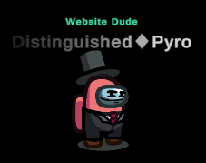

# Helpful Resources

Here are some Resources that may help you understand some things relating to the mod. Such as Hot-Keys, Commands, Template/Preset Help, and other Useful Guides/Information.

Other general help related pages can be found at [FAQ](/FAQ.html) (For common questions) as well as [Install](/Install.html) (For installation issues/questions).

<b>Hot-Keys</b>

Below is a list of Hot-Keys that you can use to make your experience better while playing Town of Host: Enhanced. You can use these Hot-Keys to perform certain actions. 

<b>Everyone</b>

<b>Everyone - General</b>

<table>
<tr>
<td align="center"> <b>Hot-Key</b></td>
<td align="center"> <b>Function</b></td>
</tr>
<tr>
<td><kbd>LeftAlt</kbd> + <kbd>Return</kbd></td>
<td>Switch to Fullscreen.</td>
</tr>
<tr>
<td><kbd>LeftAlt</kbd> + <kbd>F4</kbd></td>
<td>Use the Secret Town of Host: Enhanced Exclusive Role.</td>
</tr>
</table>

 

<b>Everyone - Mod Only</b>

<table>
<tr>
<td align="center"> <b>Hot-Key</b></td>
<td align="center"> <b>Function</b></td>
</tr>
<tr>
<td><kbd>Ctrl</kbd></td>
<td>Go through Dropship walls in lobby.</td>
</tr>
<tr>
<td><kbd>Tab</kbd></td>
<td>Do next page.</td>
</tr>
<tr>
<td><kbd>F1</kbd></td>
<td>Show role info.</td>
</tr>
<tr>
<td><kbd>F2</kbd></td>
<td>Show add-ons info.</td>
</tr>
<tr>
<td><kbd>F3</kbd></td>
<td>Show role settings.</td>
</tr>
<tr>
<td><kbd>F4</kbd></td>
<td>Show add-ons settings.</td>
</tr>
<tr>
<td><kbd>F10</kbd></td>
<td>Open the game directory.</td>
</tr>
<tr>
<td><kbd>F5</kbd> + <kbd>T</kbd></td>
<td>Reload Custom Translations.</td>
</tr>
<tr>
<td><kbd>F5</kbd> + <kbd>X</kbd></td>
<td>Export Custom Translations and Role Colors.</td>
</tr>
<tr>
<td><kbd>F11</kbd> + <kbd>LeftAlt</kbd></td>
<td>Change the resolution.</td>
</tr>
<tr>
<td><kbd>F1</kbd> + <kbd>LeftCtrl</kbd></td>
<td>Send logs.</td>
</tr>
<tr>
<td><kbd>LeftAlt</kbd> + <kbd>C</kbd></td>
<td>Copy current settings.</td>
</tr>
</table>

 

<b>Host Only</b>

 

<b>Host Only - General</b>

<table>
<tr>
<td align="center"> <b>Hot-Key</b></td>
<td align="center"> <b>Function</b></td>
</tr>
<tr>
<td><kbd>C</kbd></td>
<td>Cancel start count down.</td>
</tr>
<tr>
<td><kbd>G</kbd></td>
<td>Show intro.</td>
</tr>
<tr>
<td><kbd>I</kbd></td>
<td>Get Present Coordinate.</td>
</tr>
<tr>
<td><kbd>F6</kbd></td>
<td>Force end meeting & count votes.</td>
</tr>
<tr>
<td><kbd>LeftShift</kbd></td>
<td>Force start game.</td>
</tr>
<tr>
<td><kbd>LeftCtrl</kbd> + <kbd>LMB</kbd></td>
<td>Kill hovered player.</td>
</tr>
<tr>
<td><kbd>N</kbd> + <kbd>LeftCtrl</kbd></td>
<td>Displays the currently valid settings.</td>
</tr>
<tr>
<td><kbd>Return</kbd> + <kbd>C</kbd> + <kbd>LeftShift</kbd></td>
<td>Show chat.</td>
</tr>
<tr>
<td><kbd>Return</kbd> + <kbd>L</kbd> + <kbd>LeftShift</kbd></td>
<td>Force end game.</td>
</tr>
<tr>
<td><kbd>Return</kbd> + <kbd>M</kbd> + <kbd>LeftShift</kbd></td>
<td>Force start/end meeting.</td>
</tr>
<tr>
<td><kbd>LeftCtrl</kbd> + <kbd>LeftShift</kbd> + <kbd>E</kbd> + <kbd>Return</kbd></td>
<td>Suicide.</td>
</tr>
</table>

 

<b>Host Only - Debug</b>

<table>
<tr>
<td align="center"> <b>Hot-Key</b></td>
<td align="center"> <b>Function</b></td>
</tr>
<tr>
<td><kbd>=</kbd></td>
<td>Task number display toggle.</td>
</tr>
<tr>
<td><kbd>B</kbd></td>
<td>All players exit vent.</td>
</tr>
<tr>
<td><kbd>C</kbd></td>
<td>All players enter vent.</td>
</tr>
<tr>
<td><kbd>N</kbd></td>
<td>Clear vent.</td>
</tr>
<tr>
<td><kbd>P</kbd></td>
<td>Get Position.</td>
</tr>
<tr>
<td><kbd>Y</kbd></td>
<td>Force sync custom settings.</td>
</tr>
<tr>
<td><kbd>F2</kbd> + <kbd>LeftCtrl</kbd></td>
<td>Whether the toggle log is also output in the game.</td>
</tr>
<tr>
<td><kbd>LeftShift</kbd> + <kbd>V</kbd> + <kbd>Return</kbd></td>
<td>Teleport all players to the host.</td>
</tr>
<tr>
<td><kbd>Return</kbd> + <kbd>F</kbd> + <kbd>LeftShift</kbd></td>
<td>Kill flash.</td>
</tr>
<tr>
<td><kbd>Return</kbd> + <kbd>V</kbd> + <kbd>LeftShift</kbd></td>
<td>Clear self vote only in local game.</td>
</tr>
<tr>
<td><kbd>Return</kbd> + <kbd>D</kbd> + <kbd>LeftShift</kbd></td>
<td>Open all the doors in Airship map.</td>
</tr>
<tr>
<td><kbd>Return</kbd> + <kbd>K</kbd> + <kbd>LeftShift</kbd></td>
<td>Set kill cooldown to 0 seconds.</td>
</tr>
<tr>
<td><kbd>Return</kbd> + <kbd>T</kbd> + <kbd>LeftShift</kbd></td>
<td>Complete all your tasks.</td>
</tr>
</table>

> From: The Enhanced Network + Compiling: NotPyro404

 

<b>Chat Commands</b>

Below is a list of commands that you can use to make your experience better while playing Town of Host: Enhanced. You can use these commands in the chat box to perform certain actions.  

Note: Commands that are italicized are considered "essential" and are recommended for all players. 

<b>Everyone</b>

<b>Everyone - General</b>

<table>
<tr>
<td align="center"> <b>Command</b></td>
<td align="center"> <b>Function</b></td>
</tr>
<tr>
<td>/apocinfo</td>
<td>See how Apocalypse roles work.</td>
</tr>
<tr>
<td>/apocalypseinfo</td>
<td>See how Apocalypse roles work.</td>
</tr>
<tr>
<td>/color [color]</td>
<td>Change your Color to any, even if someone's taken it.</td>
</tr>
<tr>
<td>/colour [color]</td>
<td>Change your Color to any, even if someone's taken it.</td>
</tr>
<tr>
<td><b><i>/d</i></b></td>
<td><b>See how you died.</b></td>
</tr>
<tr>
<td><b><i>/death</i></b></td>
<td><b>See how you died.</b></td>
</tr>
<tr>
<td>/ghostinfo</td>
<td>See how Ghost roles work.</td>
</tr>
<tr>
<td>/h</td>
<td>Display out-of-date command info.</td>
</tr>
<tr>
<td>/help</td>
<td>Display out-of-date command info.</td>
</tr>
<tr>
<td>/icon</td>
<td><b>Display icons and what they mean.</b></td>
</tr>
<tr>
<td>/icons</td>
<td>Display icons and what they mean.</td>
</tr>
<tr>
<td>/iconhelp</td>
<td>Display icons and what they mean.</td>
</tr>
<tr>
<td>/kc</td>
<td>See how many killers remain.</td>
</tr>
<tr>
<td>/kcount</td>
<td>See how many killers remain.</td>
</tr>
<tr>
<td>/kh</td>
<td>Display the kill events of the previous round.</td>
</tr>
<tr>
<td>/killlog</td>
<td>Display the kill events of the previous round.</td>
</tr>
<tr>
<td><b><i>/l</i></b></td>
<td><b>Display the results of the previous round.</b></td>
</tr>
<tr>
<td><b><i>/lastresult</i></b></td>
<td><b>Display the results of the previous round.</b></td>
</tr>
<tr>
<td><b><i>/m</i></b></td>
<td><b>See your Role Info.</b></td>
</tr>
<tr>
<td><b><i>/myrole</i></b></td>
<td><b>See your Role Info.</b></td>
</tr>
<tr>
<td>/me</td>
<td>Gives information about the player's Friend Code, PUID, and more.</td>
</tr>
<tr>
<td>/n [r/roles]</td>
<td>Show all enabled roles.</td>
</tr>
<tr>
<td>/now [r/roles]</td>
<td>Show all enabled roles.</td>
</tr>
<tr>
<td>/n [a/all]</td>
<td>Show all enabled settings.</td>
</tr>
<tr>
<td>/now [a/all]</td>
<td>Show all enabled settings.</td>
</tr>
<tr>
<td>/qt</td>
<td>Leave lobby forever.</td>
</tr>
<tr>
<td>/quit</td>
<td>Leave lobby forever.</td>
</tr>
<tr>
<td>/rn [name]</td>
<td>Rename yourself in this session.</td>
</tr>
<tr>
<td>/rename [name]</td>
<td>Rename yourself in this session.</td>
</tr>
<tr>
<td>/r</td>
<td>Display list of active roles.</td>
</tr>
<tr>
<td><b><i>/r [name]</i></b></td>
<td><b>Display info on specified role.</b></td>
</tr>
<tr>
<td><b><i>/role [name]</i></b></td>
<td><b>Display info on specified role.</b></td>
</tr>
<tr>
<td>/rs</td>
<td>Display the roles played of the previous round.</td>
</tr>
<tr>
<td>/rolesummary</td>
<td>Display the roles played of the previous round.</td>
</tr>
<tr>
<td>/sum</td>
<td>Display the roles played of the previous round.</td>
</tr>
<tr>
<td>/summary</td>
<td>Display the roles played of the previous round.</td>
</tr>
<tr>
<td>/t [title]</td>
<td>Display a template.</td>
</tr>
<tr>
<td>/template [title]</td>
<td>Display a template.</td>
</tr>
<tr>
<td>/tpin</td>
<td>TP In the Dropship.</td>
</tr>
<tr>
<td>/tpout</td>
<td>TP Out the Dropship.</td>
</tr>
<tr>
<td>/vote</td>
<td>Vote any player you wish.</td>
</tr>
<tr>
<td>/win</td>
<td>Display the players that won the previous round.</td>
</tr>
<tr>
<td>/winner</td>
<td>Display the players that won the previous round.</td>
</tr>
<tr>
<td>/xf</td>
<td>Fix when names cover chat.</td>
</tr>
</table>

 

<b>Everyone - Minigames</b>

<table>
<tr>
<td align="center"> <b>Command</b></td>
<td align="center"> <b>Function</b></td>
</tr>
<tr>
<td>/8ball</td>
<td>"Shake" an 8ball.</td>
</tr>
<tr>
<td>/coinflip</td>
<td>Flip a Coin.</td>
</tr>
<tr>
<td>/gno [#]</td>
<td>Guess the Number.</td>
</tr>
<tr>
<td>/rand [#] [#]</td>
<td>Generate Random Number between the 2 values you gave.</td>
</tr>
<tr>
<td>/rps</td>
<td>Play Rock Paper Scissors.</td>
</tr>
</table>

 

<b>Everyone - Mod Only</b>

<table>
<tr>
<td align="center"> <b>Command</b></td>
<td align="center"> <b>Function</b></td>
</tr>
<tr>
<td>/dump</td>
<td>Dump Logs to Desktop.</td>
</tr>
<tr>
<td>/v</td>
<td>Check all player's mod version.</td>
</tr>
<tr>
<td>/version</td>
<td>Check all player's mod version.</td>
</tr>
</table>

 

<b>Everyone - Role Specific</b>

<table>
<tr>
<td align="center"> <b>Command</b></td>
<td align="center"> <b>Function</b></td>
</tr>
<tr>
<td><b><i>/id</i></b></td>
<td><b>Show all IDs of players in the lobby.</b></td>
</tr>
<tr>
<td>/answer [ⓐ/ⓑ/ⓒ]</td>
<td>Answer the Quizmaster's question if they've targeted you.</td>
</tr>
<tr>
<td>/qmquiz</td>
<td>Re-send the Quizmaster's question if you need to see it again.</td>
</tr>
<tr>
<td>/bt [ID] [role]</td>
<td>Guess the Role of another Player.</td>
</tr>
<tr>
<td>/cmp [ID] [ID]</td>
<td>Compare the alignments of two players as Inspector.</td>
</tr>
<tr>
<td>/duel [⓪/①/②]</td>
<td>Participate in a Pirate duel.</td>
</tr>
<tr>
<td>/finish</td>
<td>End a meeting as President.</td>
</tr>
<tr>
<td>/reveal</td>
<td>Reveal yourself as President.</td>
</tr>
<tr>
<td>/ret [ID]</td>
<td>Retribute a player as Retributionist.</td>
</tr>
<tr>
<td>/rv [ID]</td>
<td>Revenge a player as Nemesis.</td>
</tr>
<tr>
<td>/sw [ID] [ID]</td>
<td>Choose 2 players to Swap as Swapper.</td>
</tr>
<tr>
<td>/tl [ID]</td>
<td>Trial a player as Judge or Councillor.</td>
</tr>
<tr>
<td>/ms [yes/no]</td>
<td>Answer the Medium's 'Yes or No' question as a Ghost.</td>
</tr>
</table>

 

<b>VIP Only</b>

<table>
<tr>
<td align="center"> <b>Command</b></td>
<td align="center"> <b>Function</b></td>
</tr>
<tr>
<td>/color [color]</td>
<td>Change your Color to any, even if someones taken it.</td>
</tr>
<tr>
<td>/colour [color]</td>
<td>Change your Color to any, even if someones taken it.</td>
</tr>
<tr>
<td>/rn [name]</td>
<td>Rename yourself in this session.</td>
</tr>
<tr>
<td>/rename [name]</td>
<td>Rename yourself in this session.</td>
</tr>
<tr>
<td>/tagcolor</td>
<td>Changes the player's tag color.</td>
</tr>
<tr>
<td>/tagcolour</td>
<td>Changes the player's tag color.</td>
</tr>
<tr>
<td>/vipcolor [HEXCODE]</td>
<td>Change your tag color.</td>
</tr>
</table>

 

<b>Moderator Only</b>

<table>
<tr>
<td align="center"> <b>Command</b></td>
<td align="center"> <b>Function</b></td>
</tr>
<tr>
<td>/ban [ID] [reason]</td>
<td>Ban specified player.</td>
</tr>
<tr>
<td>/kick [ID] [reason]</td>
<td>Kick specified player.</td>
</tr>
<tr>
<td>/mid</td>
<td>Show All Players IDs.</td>
</tr>
<tr>
<td>/modcolor [HEXCODE]</td>
<td>Change your tag color.</td>
</tr>
<tr>
<td><b><i>/s [message]</i></b></td>
<td><b>Send moderator message.</b></td>
</tr>
<tr>
<td><b><i>/say [message]</i></b></td>
<td><b>Send moderator message.</b></td>
</tr>
<tr>
<td>/tagcolor</td>
<td>Changes the player's tag color.</td>
</tr>
<tr>
<td>/tagcolour</td>
<td>Changes the player's tag color.</td>
</tr>
<tr>
<td>/warn [ID] [reason]</td>
<td>Warn specified player.</td>
</tr>
</table>

 

<b>Host Only</b>

<table>
<tr>
<td align="center"> <b>Command</b></td>
<td align="center"> <b>Function</b></td>
</tr>
<tr>
<td>/changerole</td>
<td>Allows the Host to change their role midround to a vanilla one.</td>
</tr>
<tr>
<td>/cosid</td>
<td>Logs the current outfit accessory IDs.</td>
</tr>
<tr>
<td>/cs [sound]</td>
<td>Play a custom sound (sound = file name in TOHE).</td>
</tr>
<tr>
<td>/dis [crew/imp]</td>
<td>Someone Disconnected.</td>
</tr>
<tr>
<td>/disconnect [crew/imp]</td>
<td>Someone Disconnected.</td>
</tr>
<tr>
<td>/end</td>
<td>Ends the game.</td>
</tr>
<tr>
<td>/exe [ID]</td>
<td>Execute specified player (no body).</td>
</tr>
<tr>
<td>/hn</td>
<td>Hide your name.</td>
</tr>
<tr>
<td>/hidename</td>
<td>Hide your name.</td>
</tr>
<tr>
<td><b><i>/id</i></b></td>
<td><b>Show all IDs of players in the lobby.</b></td>
</tr>
<tr>
<td>/level [#]</td>
<td>Sets the player's level to the number they choose for that session.</td>
</tr>
<tr>
<td>/kill [ID]</td>
<td>Kill specified player (leave body).</td>
</tr>
<tr>
<td>/mw</td>
<td>Sets the amount of time modded clients must wait between messages.</td>
</tr>
<tr>
<td>/messagewait</td>
<td>Sets the amount of time modded clients must wait between messages.</td>
</tr>
<tr>
<td>/poll</td>
<td><b>Begin a poll in your lobby.</b></td>
</tr>
<tr>
<td>/rn [name]</td>
<td>Rename yourself in this session.</td>
</tr>
<tr>
<td>/rename [name]</td>
<td>Rename yourself in this session.</td>
</tr>
<tr>
<td><b><i>/s [message]</i></b></td>
<td><b>Send host message.</b></td>
</tr>
<tr>
<td><b><i>/say [message]</i></b></td>
<td><b>Send host message.</b></td>
</tr>
<tr>
<td>/sd [sound]</td>
<td>Plays a sound which exists in the game.</td>
</tr>
<tr>
<td>/setplayers</td>
<td>Set maximum lobby size.</td>
</tr>
<tr>
<td>/tagcolor</td>
<td>Changes the player's tag color.</td>
</tr>
<tr>
<td>/tagcolour</td>
<td>Changes the player's tag color.</td>
</tr>
<tr>
<td>/up [role]</td>
<td>Select a specified role that you'll be in the next match.</td>
</tr>
</table>

> From: The Enhanced Network + Compiling: NotPyro404

 

<b>TOHE-DATA Info</b>

Open the root directory of game: `...\Among Us\TOHE-DATA\`

There are a few files:

- `BanList.txt`: A list of friendcodes that will be unable to join your lobby.

- `Default_Teamplate.txt`: This is the Default TOHE Template file. If you wish to reset your templates to default, You can use this. (No idea why it says Teamplate.)

- `DenyName.txt`: A list of names that will be filtered out of the game.

- `Moderators.txt`: A list of friendcodes that will receive a nice Moderator tag (editable via `...\Among Us\Language\english.dat`) as well as permissions to moderate your lobby (such as using the commands near the top of the page). Only grant users you trust these permissions! (NOTE: `english.dat` is only if you are on the English Translation of base game Among Us. If you are using another Translation, please rename the english part to the translation you are using. (ie: `Spanish.dat/SChinese.dat/Latam.dat`/so on.) A list of all base game supported translations can be found on the [Resources](./Resources.html) Page.)

- `template.txt`: You can modify the `welcome` and `onMeeting` messages here. You can also add custom templates here as well following the same format as `welcome` & `onMeeting` use.

- `VIP-List.txt`: A list of friendcodes that will be given a sweet VIP tag (editable via `...\Among Us\Language\english.dat`) as well as permissions to change their name color. (NOTE: `english.dat` is only if you are on the English Translation of base game Among Us. If you are using another Translation, please rename the english part to the translation you are using. (ie: `Spanish.dat/SChinese.dat/Latam.dat`/so on.) A list of all base game supported translations can be found on the [Resources](./Resources.html) Page.)

- `WhiteList.txt`: A list of friendcodes that will be exempt from blacklisted platforms, along with level requirements.

> From: The Enhanced Network + Compiling: NotPyro404

 

<b>Templates Info</b>

Open the root directory of the mod and find the `..\Among Us\TOHE-DATA\template.txt` file.

You can see that there are some words in the file, such as `welcome`, `onMeeting`, and other gibberish.
- `welcome:exampleMessage` - this is the message that will be sent when other players enter your lobby.
- `onMeeting:exampleMessage` - this is the message that will be sent when each meeting starts. 
- `onFirstMeeting:exampleMessage` - this is just like `onMeeting`, but the message sent here will only be sent on the <i>first</i> meeting. Any meetings after will prioritize `onMeeting`. 

You can edit these templates, or add your own on new-lines!

On a new-line, you want to add your trigger word and your message. Such as: `[example]:this is an example template!` <i>(The trigger word being `[example]` and the message being `this is an example template!`. (YOU NEED THE `:`!))</i> You can add as many of these as you want. You can then save the file, boot up the mod, and run `/t [example]` in your chat box to see if it's set up to your liking!

Alternatively, you may also use this [Template Editor](https://ultradragon005.github.io/AmongUs-Utilities/editor.html) put together by one of TOHE's Contributors, [Drakos](https://github.com/Ultradragon005).

<b>Guide</b>

There is a Tutorial at the bottom of the Template Editior's page if you need it. If you do not want to watch it, here's a small guide abounht how to use it.

1. Enter a Title for the template. This title will be displayed at the top of the template when its activated in game. Here's what the title will look like by default:

2. Enter in what you want the template to display. You can edit the Font Size & Text Colors, but it is recommended to do it last. (From: Drakos)
3. Enter in the name for this template. This name will also be the trigger word for this template. `[example]:this is an example template!` (`[example]` being the name/trigger word)
4. Click the "Copy as HTML Formatted" to copy your template to your clipboard.
5. Locate `..\Among Us\TOHE-DATA\template.txt` and paste your new template on a new-line.
6. You can then save the file [`[Ctrl] + [S]`], boot up the mod, and run `/t [example]` in your chat box to see if it's set up to your liking!

If you create copies of the template name on newlines, it will send them in seperate messages. Here's an example from Drakos: 

> From + Compiling: NotPyro404 + Images: Drakos

 

<b>Template Editor</b>

Here's a Template Editor which you can use to edit or create templates. 
[Template Editor](https://ultradragon005.github.io/AmongUs-Utilities/editor.html) 

The Template Editor is only 1 of the many Utilities (Also by Drakos) which are on this [Among Us Utilities](https://ultradragon005.github.io/AmongUs-Utilities/index.html) page. You can find a [Welcome Message Guide](https://ultradragon005.github.io/AmongUs-Utilities/guide.html), [Pixel Art Editor](https://ultradragon005.github.io/AmongUs-Utilities/pixelgrid.html), [Gallery](https://ultradragon005.github.io/AmongUs-Utilities/gallery.html), & also the [Template Editor](https://ultradragon005.github.io/AmongUs-Utilities/editor.html) shown already.  

> From: Drakos

 

<b>template.dat Info</b>

You can edit your `template.dat` to say really anything you want! You can also download custom templates shared by others. If you want to use one, make sure the file is renamed to `english.dat` before using it, if it isn't already. (NOTE: english.dat is only if you are on the English Translation of base game Among Us. If you are using another Translation, please rename the english part to the translation you are using. (ie: `Spanish.dat/SChinese.dat/Latam.dat`/so on.) A list of all base game supported translations can be found on the [Resources](./Resources.html) Page.)  

Note: You have to put the file in the following directory: `.\Among Us\Language` for it to work. (Make sure your file is a `.dat` file, otherwise it will not work. Paste it alongside the `template.dat` file already in your folder.)  

You can do a lot with your `template.dat`, for this though, we'll refer to it as `english.dat` for simplicity sake. For starters, you can edit the Host Text, Icon, & Color. I won't go into depth on <i>everything</i> that the `english.dat` can edit, but it's almost every line of text that can be displayed on the screen. Once you get the hang of editing the Host Text, Icon, & Color, you can move down the list to edit anything you really want to (Such as Role Names, Role Descriptions, VIP Text, Moderator Text, and more). 
Below is what the default `template.dat` looks like, Versus what the edited `english.dat` I have looks like. 
 
Versus what the edited `english.dat` I have looks like. 
  

Just mess around a little bit, and have fun! Make sure you copy your template as a backup before you try messing with it again, or messing with the mod itself. 

For some member submitted translations (not yet supported by Town of Host: Enhanced/Base game Among Us), browse [here](/Translations.html). 

> From + Compiling: NotPyro404

 

<b>Valid Variables</b>

- `{{PlayerSpeedMod}}` - Displays the speed of players.
- `{{CrewLightMod}}` - Displays the vision radius of a Crewmate.
- `{{ImpostorLightMod}}` - Displays the vision radius of an Impostor.
- `{{KillCooldown}}` - Displays the default Kill Cooldown set in your Among Us settings.
- `{{NumCommonTasks}}` - Displays the amount of Common Tasks per player.
- `{{NumLongTasks}}` - Displays the amount of Long Tasks per player.
- `{{NumShortTasks}}` - Displays the amount of Short Tasks per player.
- `{{AmongUsVersion}}` - Displays the current Among Us version.
- `{{InternalVersion}}` - Displays the source code plugin version.
- `{{NumEmergencyMeetings}}` - Displays the amount of emergency meetings allowed per player.
- `{{EmergencyCooldown}}` - Displays the cooldown before you can call another meeting after the last one is finished.
- `{{DiscussionTime}}` - Displays the time period where you can talk before voting.
- `{{VotingTime}}` - Displays the time period where you vote.
- `{{Date}}` - Displays the current date.
- `{{Time}}` - Displays the current time.
- `{{RoomCode}}` - Displays the Room Code.
- `{{PlayerName}}` - Displays the players username. (The one reading the variable)
- `{{HostName}}` - Displays the hosts username.
- `{{ModVersion}}` - Displays the current version of Town of Host: Enhanced.
- `{{Map}}` - Displays the Map that is going to be played.

> From: The Enhanced Network + Compiling: NotPyro404

 

<b>Text Formatting</b>

- `<color=#[hex]>exampleText</color>` Changes the  Color  of the text/font.
- `<b>exampleText</b>` Enables <b>Bold</b> for the text/font.
- `<s>exampleText</s>` Enables <s>Strikethrough</s> for the text/font.
- `<u>exampleText</u>` Enables <u>Underline</u> for the text/font.
- `<i>exampleText</i>` Enables <i>Italics</i> for the text/font.
- `<mark>exampleText</mark>` Enables <mark>Highlight</mark> for the text/font.
- `exampleText` Enables Superscript for the text/font.
- `exampleText` Enables Subscript for the text/font.
- `<size=[size][%]>exampleText</size>` Sets the Size of the text/font. (Can type exact text/font sizes or use percentages.)
- `\n` Creates a New Line. (Such as ` ` (or the `[Enter]` key) would)

> From: The Enhanced Network + Compiling: NotPyro404

 

<b>Supported Rich Text Tags</b>

Here's a full list of Rich Text Tags that you can use for formatting. Some may not work, so keep that in mind. There is a `` tag, that will not work with all fonts, it will only work with the Fonts covered in the next dropdown menu.
[Link to List](https://docs.unity3d.com/Packages/com.unity.textmeshpro@3.2/manual/RichTextSupportedTags.html)  

> From: Unity Technologies

 

<b>Usable Fonts/Symbols</b>

Here's a Doc covering Fonts & Symbols that you can use while creating Templates! This Doc also shows some Sprites which are technically other Symbols, as well as some Icons and what exactly they mean when you see them! 
[Link to Doc](https://docs.google.com/document/d/e/2PACX-1vQh4sc9RL_Byt3kextqngdaAuGovFO_YaxHITZsIKqcd39mUAc6sQ89sfsSRGZsHUCecfIQiDY2WtQ-/pub)  

> From: Drakos

 

<b>Original Role Colors (Hex Codes)</b>

You can find the <i>original</i> Hex Codes of Town of Host: Enhanced Roles [Here](https://github.com/0xDrMoe/TownofHost-Enhanced/blob/main/Resources/roleColor.json).  

> From: The Enhanced Network

 

<b>Presets Info</b>

You can save your favorite settings as presets and load them later. You can also download presets shared by others. If you want to use a preset, make sure the file is renamed to `Options.json` before using if, it isn't already. (If you do not have `File name extensions` marked on the `View` Tab, you only need to rename it to `Options`.) 

Note: You have to put the file in the following directory: `.\Among Us\TOHE-DATA\SaveData` for it to work. (If you cannot locate `TOHE-DATA\SaveData`, try enabling `Hidden items` on the `View` Tab!) 

For some member submitted presets, browse [here](/Presets.html). 

> From + Compiling: NotPyro404

 

<b>Member Submitted Presets + More</b>

For Member Submitted Presets, visit the [Presets](/Presets.html) page.
For Member Submitted Translations, visit the [Custom Translations](/Translations.html) page.

> From + Compiling: NotPyro404

 

<b>Death Reasons</b>

Here's a list of Death Reasons, and what makes them occur: [Death Reasons](https://docs.google.com/document/d/e/2PACX-1vTD5Qn3DchoADfPjxH1j11wfXzp3Is9GAMYnZYt5RePbM7OS_Iz4mNWgigQvN3rkFHh_QVfBguhV0rb/pub) 
If you don't want to read the Doc, they will all be listed below!  

`- Death Reason` 
`Role/Scenario: (Rough Explanation)`  

- Kill 
Any Role that can Kill (Is applied to any role that does not have a special death reason)  

- Ejected 
When a player is voted (Is applied when a player is voted out during a Meeting)  

- Suicide 
Unlucky (Happens to the player by chance) 
Ghoul (If the player with Ghoul finishes all tasks when alive) 
Addict (If the Addict does not vent by the suicide timer) 
Deathpact (If the marked players do not meet in time) 
Mastermind (If the manipulated target does not kill by the timer, or a meeting is called while they are manipulated) 
Mercenary (If Mercenary does not kill by the suicide timer) 
Pixie (Can only happen if Pixie suicides if target is not voted out setting is on) 
Terrorist (Can only happen if Can Win by Suicide setting is on)  

- Disconnected 
Player leaves the Game (If no cause of death was established, does not always display if the player disconnected)  

- Fall 
Ladders on Airship/Fungle (Fall From Ladders setting)  

- Guessed 
Evil Guesser (If a player was guessed or if a player misguessed) 
Nice Guesser (If a player was guessed or if a player misguessed) 
Doomsayer (If a player was guessed or if a player misguessed) 
Guesser (If a player was guessed or if a player misguessed) 
Guesser Mode (If a player was guessed or if a player misguessed)  

- Other 
Shouldn’t happen (404: DeathReasonNotFound) 
Game Master (Only exception, the death reason of Game Master will be Other)  

- Spelled 
Witch (Given to a player marked by the Witch if the Witch isn't voted out)  

- Cursed 
Cursed Wolf (Given to players killed by the Cursed Wolf's reflect)  

- Hexed 
Hex Master (Given to a player marked by the Hex Master if the HexMaster isn't voted out)  

- Heartbroken 
Lovers (Given to the other Lover when their Lover died)  

- Bitten 
Vampire (Given to players that Vampire has used their kill button on)  

- Poisoned 
Poisoner (Given to players that Poisoner has used their kill button on) 
Alchemist (Poison Potion)  

- Exploded 
Bomber (Given to players within the radius of the Bomber when it explodes) 
Nuker (Given to players within the radius of the Nuker when it explodes) 
Fireworker (Given to players killed by the Fireworker's fireworks) 
Berserker (If Bombed Kills setting on) 
Bastion (Given to players if they use a vent that the Bastion did) 
Agitator (Given to players if they hold the Agitator's bomb (hot potato) and don't pass it on) 
Taskinator (Given to player if they do a task that the Taskinator did)
Terrorist (Given to all players when Terrorist meets their win-condition) 
Burst (Given to Killer if they killed a player with Burst & failed to stay in a vent when the detonation goes off)  

- Misfire 
Deceiver (Whoever Deceiver’s ability is used on) 
Reverie (If Cooldown increases too much) 
Sheriff (If Sheriff tries to kill player with role they aren’t allowed to kill) 
Fireworker (If Fireworker is in their own radius when they explode) 
Hater (Hater kills target when misfire setting) 
Pursuer (When whoever Pursuer blanks attempts to kill) 
Vengeful Romantic (If killed someone other than partner’s killer)  

- Burned 
Arsonist (Given to players that have been doused when the Arsonist vented & killed)  

- Sniped 
Sniper (Given to players that have been killed by the Sniper)  

- Revenge 
Avenger (Happens to a random player when player with Avenger is killed) 
Randomizer (Happens by chance) 
Retributionist (Whoever Retributionist kills using their '/rv' command) 
Butcher (If Butcher kills Avenger then EVERYONE gets this) 
Nemesis (Whoever Nemesis kills using their '/rv' command)  

- Execution 
Jailer (Given to the players that the Jailer has jailed & killed)  

- Eaten 
Pelican (Given to the players that the Pelican has used their kill button on)  

- Victim 
Hater (Given to the player that the Hater successfully killed) 
Revolutionist (Given to the player that the Revolutionist attempted to recruit) 
Bodyguard (Given to the Bodyguard themselves)  

- Quantization 
Lightning (Given if a player touches another player after becoming Quantum Ghost)  

- Overtired 
Workholic (Given to the Workholic if they complete their tasks)  

- Ashamed 
Workaholic (Given to everyone else alive if Workaholic completes their tasks)  

- Destroyed 
Provocateur (Given to the Provocateur's target) 
Crusader (Given to Crusader if it tries to kill Pestilence)  

- Dismembered 
Butcher (Given to players the Butcher has killed)  

- Strangled 
Hangman (Given to players the Hangman has killed while they were shapeshifted)  

- Judged 
Councillor (Given to players that the Councillor used their '/tl' command on) 
Judge (Given to players that the Judge used their '/tl' command on)  

- Infected 
Infectious (Given to players killed by the Infectious) 
Plague Scientist (Given to players killed by the Plague Scientist) 
Virus (Given to players killed by the Virus)  

- Jinxed 
Jinx (Given to players killed by the Jinx's reflect)  

- Hacked 
Glitch (Given to players killed by the Glitch)  

- Plundered 
Pirate (Given to a player that loses the duel against the Pirate)  

- Shrouded 
Shroud (Given to a player marked by the Shroud if the Shroud isn't voted out, or the player hasn't performed a kill)  

- Mauled 
Werewolf (Given to players caught in the Werewolf's Maul Radius)  

- Drained 
Puppeteer ('Puppet dies alongside victim' Setting)  

- Shattered 
Fragile (Given to a player that any Impostor based role interacted with)  

- Trapped 
Trapster (Given to players that report a body killed by the Trapster)  

- Targeted 
Kamikaze (Given to players killed when the Kamikaze dies)  

- Retribution 
Instigator (Given to players that voted for the same player that the Instigator voted for)  

- Sliced 
Hawk (Given to a player that the Hawk has haunted)  

- Bleed 
Bloodmoon (Given to a player that the Bloodmoon has haunted)  

- Wrong Quiz Answer 
Quizmaster (Given to players that incorrectly answer a question from the Quizmaster)  

- Starved 
Famine (Given to anyone without bread after Famine transforms and is not voted out, or when famine uses their kill button on a player after that)  

- Armageddon 
Death (Given to everyone alive if Death is not voted out when they transform)  

- Alive 
Bug (This Death Reason occured awhile ago due to bugs, but has since been patched out)  

> From: Marg + Compiling: NotPyro404

 

<b>Icons: Explained</b>

<table>
<tr>
<td align="center"><b>Icon</b></td>
<td align="center"><b>Scenario</b></td>
</tr>
<tr>
<td>†</td>
<td>This player was spelled by a Witch</td>
</tr>
<tr>
<td>乂</td>
<td>This player was hexed by a Hex Master</td>
</tr>
<tr>
<td>◈</td>
<td>This player was shrouded by a Shroud</td>
</tr>
<tr>
<td>⦿</td>
<td>This player is being dueled by a Pirate</td>
</tr>
<tr>
<td>?!</td>
<td>This player is being quizzed by a Quizmaster</td>
</tr>
<tr>
<td>⚠</td>
<td>This player is a Snitch who is about to finish their tasks</td>
</tr>
<tr>
<td>⚠</td>
<td>This player is a Solsticer who is about to finish their tasks</td>
</tr>
<tr>
<td>✚</td>
<td>This player has a Medic Shield</td>
</tr>
<tr>
<td>♦</td>
<td>This player is the Executioner's target</td>
</tr>
<tr>
<td>♦</td>
<td>This player is your Lawyer</td>
</tr>
<tr>
<td>♦</td>
<td>This player is your Follower</td>
</tr>
<tr>
<td>♥</td>
<td>This player is a Romantic</td>
</tr>
<tr>
<td>♥</td>
<td>This player is a Lover</td>
</tr>
<tr>
<td>★</td>
<td>This player is a Super Star</td>
</tr>
<tr>
<td>★</td>
<td>This player is a Cyber</td>
</tr>
<tr>
<td>★</td>
<td>This player is a Marshall</td>
</tr>
<tr>
<td>☆</td>
<td>This player is a Captain</td>
</tr>
<tr>
<td>☜</td>
<td>This player is a teammate of the Schrodinger's Cat</td>
</tr>
<tr>
<td>⊠</td>
<td>This player is marked by the Jailer</td>
</tr>
<tr>
<td>╳</td>
<td>This player is blackmailed by the Blackmailer</td>
</tr>
<tr>
<td>∇</td>
<td>This player is marked by the Kamikaze</td>
</tr>
<tr>
<td>■</td>
<td>This player is a quantum ghost marked by the Lightning</td>
</tr>
<tr>
<td>●</td>
<td>Used by the Baker to mark who has Bread</td>
</tr>
<tr>
<td>♠</td>
<td>Used by the Soul Collector to mark who's death they're predicting.</td>
</tr>
<tr>
<td>⦿</td>
<td>Used by the Plaguebearer to mark who they have plagued.</td>
</tr>
<tr>
<td>¿</td>
<td>Used by the Telepathy to set their target, target also sees this on Telepathy.</td>
</tr>
<tr>
<td>⌘</td>
<td> Visible on the Messenger about to speak.</td>
</tr>
</table>

> From + Compiling: NotPyro404

 

<b>Among Us Supported Languages</b>

Below is a list of all languages supported by Vanilla Among Us.  

- <b>French</b> - French 
- <b>Japanese</b> - Japanese 
- <b>Latam </b> - Latin American 
- <b>Italian</b> - Italian 
- <b>Spanish</b> - Spanish 
- <b>SChinese</b> - Simplified Chinese 
- <b>TChinese</b> - Traditional Chinese 
- <b>English</b> - English 
- <b>Brazilian</b> - Portuguese Brazil 
- <b>Russian</b> - Russian 
- <b>Dutch</b> - Dutch 
- <b>German</b> - German 
- <b>Portuguese </b> - Portuguese Portugal 
- <b>Korean</b> - Korean 
- <b>Filipino</b> - Filipino 
- <b>Irish</b> - Irish 

> From: Innersloth + Compiling: NotPyro404

 

<b>Among Us Color Options</b>

Below is a list of all colors + their IDs supported by Vanilla Among Us.  

<table>
<tr>
<td align="center"><b>ID</b></td>
<td align="center"><b>Color</b></td>
</tr>
<tr>
<td>0</td>
<td>Red</td>
</tr>
<tr>
<td>1</td>
<td>Blue</td>
</tr>
<tr>
<td>2</td>
<td>Green</td>
</tr>
<tr>
<td>3</td>
<td>Pink</td>
</tr>
<tr>
<td>4</td>
<td>Orange</td>
</tr>
<tr>
<td>5</td>
<td>Yellow</td>
</tr>
<tr>
<td>6</td>
<td>Black</td>
</tr>
<tr>
<td>7</td>
<td>White</td>
</tr>
<tr>
<td>8</td>
<td>Purple</td>
</tr>
<tr>
<td>9</td>
<td>Brown</td>
</tr>
<tr>
<td>10</td>
<td>Cyan</td>
</tr>
<tr>
<td>11</td>
<td>Lime</td>
</tr>
<tr>
<td>12</td>
<td>Maroon</td>
</tr>
<tr>
<td>13</td>
<td>Rose</td>
</tr>
<tr>
<td>14</td>
<td>Banana</td>
</tr>
<tr>
<td>15</td>
<td>Gray</td>
</tr>
<tr>
<td>16</td>
<td>Tan</td>
</tr>
<tr>
<td>17</td>
<td>Coral</td>
</tr>
</table>

> From: Innersloth + Compiling: NotPyro404

