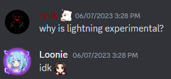

# 🌩️ <b>Lightning</b> <Badge text="Impostor" type="tip" vertical="middle"/>
---
Experimental Reason: 

---
Note: Most likely an Impostor Concealing

The Lightning cannot do regular kills. After the Lightning uses their kill button on the target, the target will vaporize into a quantum ghost after a set time, and everyone can see the 「■」 next to the name of the quantum ghost as a reminder. If there is non-spherical lightning and a player who is not a quantum ghost touches the quantum ghost, the quantum ghost will be quantized immediately and die. If the quantum ghost survives until a meeting, they will die after the meeting ends. During this time, any active interaction (kill button) with the quantum ghost has no effect. According to the host's settings, killing the Lightning may cause the killer to vaporize into a quantum ghost.
* Max
  * Set the Maximum amount of Lightnings that can be in a match
* Lightning Cooldown
  * Set how long a Lightning needs to wait to be able to Quantimize someone
* Duration of the transformation to Quantum Ghost
  * Set how long it takes for the player to turn into a Quantum Ghost after the Lightning tries to Kill them.
* Killer can transform into Quantum Ghost
  * ON: The Lightning can become a Quantum Ghost
  * OFF: The Lightning cannot become a Quantum Ghost

> From: [提米SaMa-](https://space.bilibili.com/1677307793) & Coding: [KARPED1EM](https://github.com/KARPED1EM)